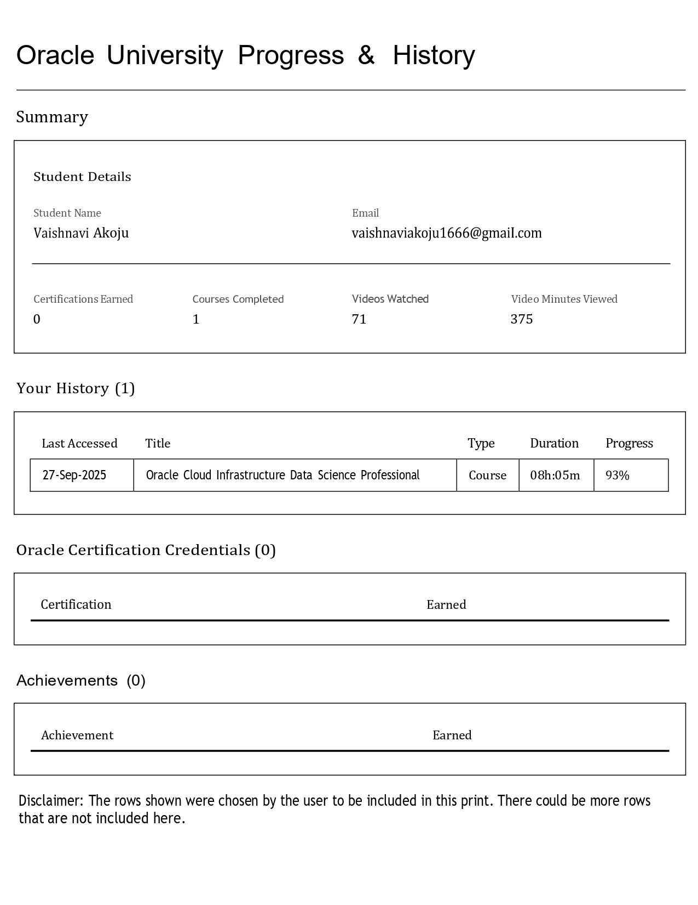

# 🚀 OCI Data Science Professional Certification Journey

I recently completed the **Oracle Cloud Infrastructure (OCI) Data Science Professional Course** under the Oracle Race to Certification program 🎓.  

This was a hands-on journey into **machine learning on the cloud**, where I built, deployed, and monitored ML pipelines end-to-end.  

---
 ## Progress

## 🌟 What I Learned
- 🗂️ Setting up **secure OCI Data Science workspaces and projects**  
- 🧹 Preparing and transforming datasets with **ADS SDK**  
- 🤖 Training models using **XGBoost** & **scikit-learn**  
- ✅ Evaluating models with metrics like accuracy & ROC-AUC  
- 🚀 Deploying models as **REST APIs** for real-time predictions  
- ⚙️ Automating pipelines with **MLOps best practices**  
- 🔐 Integrating OCI services (Vault, Data Flow, Object Storage, Data Labeling)  
- 📊 Monitoring deployed models and automating retraining  

---

## 🎥 My Experience & Video Presentation
👉 [Click here to watch my experience and what I learned from this course](https://drive.google.com/file/d/1ew66e17Jxjo6kTl1pSBC9v-wGQykyzBh/view?usp=sharing)

---

## 🛠️ Tools & Services
- **OCI Data Science Workspaces**  
- **ADS SDK**  
- **XGBoost, scikit-learn**  
- **Vault, Data Flow, Object Storage, Data Labeling**  
- **OCI Logging & Monitoring**  

📌 Now I can confidently build **production-ready ML pipelines** on OCI!  
